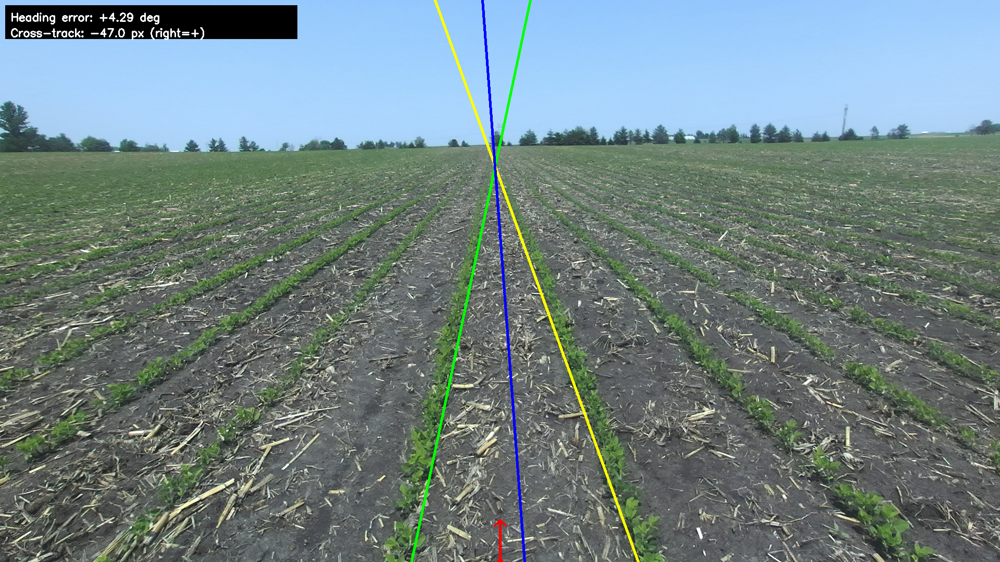

# 🌾 Visual Servoing for Crop-Row Navigation
### Computer Vision | OpenCV | Agricultural Robotics

A visual servoing algorithm that enables autonomous robot navigation through farm fields using only a front-facing camera. Developed as a hiring project for **Salin247.com** — the robot stays centered between two middle crop rows by computing real-time heading and cross-track errors from raw field images.

---
## 🎬 
(https://www.youtube.com/watch?v=rKJCsscT83E)
## 🎯 Problem Statement

A ground robot must navigate between two middle crop rows using a single front-facing camera. The algorithm processes each camera frame and returns two control-relevant measurements:

- **Heading Error** — angular difference between the robot's direction and the crop row centerline (degrees)
- **Cross-Track Error** — lateral offset of the robot from the row midline (pixels)

Field conditions vary significantly: lighting, soil texture, vegetation density, and camera angle all challenge robust detection.

---

## 🧠 Algorithm Overview

Two complementary methods are fused for robust crop-row detection:

### Geometry-Based (Hough Transform)
- Applies vegetation mask using HSV + ExG (Extra Green) + ExGR (Extra Green-Red) indices to isolate crops from soil and sky
- Extracts vegetation edges via **Sobel + auto-Canny** (threshold derived from image median intensity)
- Runs **Probabilistic Hough Transform** to detect line segments
- Filters nearly-vertical lines and selects the best left-right pair using a **center-bias + vegetation support score**

### Histogram-Based
- Divides the lower image into horizontal bands
- For each band, computes column-wise vegetation pixel density
- Smooths with Gaussian blur and finds dominant peaks left and right of center
- Collects peaks across heights and fits lines x = ay + c through each point set

The final result is the midline between the two detected rows, from which heading and cross-track errors are derived geometrically.

---

## 📁 Repository Structure

```
.
├── crop_segmentation.py   # Main detection script
├── crop_batch.sh          # Batch processing for all images
├── images/                # Input field images (ZED camera)
│     └── *.png
├── Results/               # Output visualizations (auto-created)
└── README.md
```

---

## 🚀 Getting Started

```bash
# Clone the repository
git clone https://github.com/Ranabir034/crop-row-navigation.git
cd crop-row-navigation

# Install dependencies
pip install numpy opencv-python

# Run on a single image
python3 crop_segmentation.py \
    --image images/input.png \
    --out Results/single_out.png

# Debug mode (visualizes intermediate steps)
python3 crop_segmentation.py \
    --image images/Reference.png \
    --out Results/debug_out.png \
    --debug

# Batch process all images
./crop_batch.sh
```

---

## 📊 Results

On the reference image, the algorithm outputs:

```
Heading error:    +4.29 deg
Cross-track error: -47.0 px  (right = +)
```

The pipeline correctly identifies left and right crop rows across varied field conditions, with adaptive thresholding significantly improving robustness over fixed-threshold approaches.

| Challenge | Solution |
|-----------|----------|
| Inconsistent thresholding | Auto-Canny from image median intensity |
| Weak vegetation contrast | Combined HSV + ExG + ExGR masking |
| Hough line instability | Center-bias + vegetation support scoring |
| Variable ROI | Adaptive lower-60% crop based on vegetation energy |

---

## 🔧 Key Implementation Details

- Vegetation mask combines **HSV thresholding** with **ExG** (2G - R - B) and **ExGR** (ExG - 1.4R - G) indices for robust soil/sky separation
- **Auto-Canny** sets edge thresholds dynamically from the median pixel intensity, eliminating manual tuning per image
- Line pair selection uses a composite score: `score = |mid - cx| + 0.01 * gap`, balancing center alignment with row spacing
- Adaptive ROI focuses on the lower vegetation-rich portion of the image, reducing false detections from sky and distant features

---

## 📚 Tools & Libraries


---

## 👤 Author

**Ranabir Saha**  
Ph.D. Student, Mechanical Engineering — Iowa State University  
[LinkedIn](https://www.linkedin.com/in/ranabir-saha/details/projects/) • [GitHub](https://github.com/Ranabir034)  
ranabir@iastate.edu
